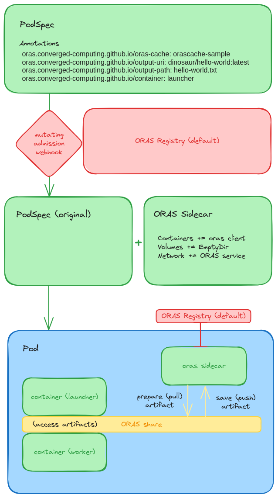
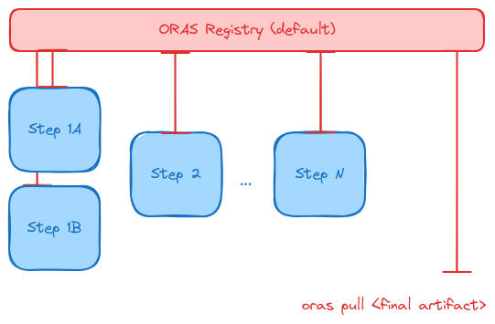

# Current Design

When running workflows, it is common to have intermediate artifacts that need to transition between
steps. The typical strategy is to mount some persistent storage (e.g., cloud object storage)
and then share the space. However, this approach has the drawback of requiring a different solution
per cloud, and requiring a different setup locally. The solution proposed here would work across clouds
(or local) and provide a registry (OCI Registry cache) that can serve this purpose. The benefits of ORAS are:

- An effective / efficient protocol for pushing/pulling artifacts from a namespaced registry
- Support for authentication / permissions (if needed, can be scoped to a namespace)
- Expecting artifacts that range from small to large
- With recent libraries, an ability to live patch an artifact (without retrieving the entire thing)

This means with an OCI registry (and ORAS as the client to handle interaction with it) running alongside
a workflow or set of experiments, we can test the following approach / take the following steps:

1. Create an operator (this one) that creates the ORAS registry to exist in a namespace and be provided via a service.
2. Watch for labels (coming from any Kubernetes workload abstraction that uses pods to run applications) that provide metadata about storage paths and needs.
3. Given one or more pods are detected, the controller will inject a sidecar using a [mutating admission webhook](https://kubernetes.io/docs/reference/access-authn-authz/admission-controllers/#mutatingadmissionwebhook) that will manage adding the storage. This is a simple interaction that would come down to:
  - A sidecar container with the ORAS client installed and credentials
  - A known identifier for the artifact to pull, and to what path
  - Pulling the artifact to the desired path via a shared empty volume
4. Some logic would need to be added to ensure that the application does not start until this is done (need to think about this, possibly something with readiness).
5. The workflow step would then proceed to run as expected, but with access to the needed assets from previous step(s)
6. When the main application is done, the sidecar would need to (if specified by the metadata) upload the result to an artifact for the next step. 
7. If desired, the user (at the end of the workflow run) can pull any artifacts that are needed to persist or save, and then cleanup.

The sidecar will need to have a way to determine when the main application is done (not sure about that yet). If we are somehow wrapping the main entrypoint while waiting, it could be grabbing the pid of that run and watching via a shared process namespace, but that might be too messy. Note that the pod will not clean up until both are done.

## Development Plan

I am going to start with a simple case of creating one Job with labels (metadata) to indicate creating artifacts for whatever my workflow does, and then retrieving some first step file, running something, and saving it and pulling the result to my local machine.

After that I'll bring in an actual DAG and workflow tool (e.g., Snakemake) and allow the tool to specify the metadata. I have this need already for Kueue and Snakemake (the executor plugin) so will work on that.

## Implementation

For the first implementation, the above was mostly successful! We can inspect the diagram below to see how it works:

### 1. Registry

We deploy the ORAS Operator as a custom resource definition, meaning we deploy a registry service to a namespace, and it will be interacted with via a mutating admission webhook. The registry will be accessible via a headless service in that namespace. This is the second block of red in the picture above.

### 2. PodSpec

In the very top (green) panel, we see a PodSpec (for some application) that has annotations for the ORAS Operator, or more specifically, the registry running in the same namespace. Any pod that is admitted into Kubernetes (and note that this can be a pod that is generated from a Job, JobSet, or Deployment, another operator, or really any means) is going to be inspected for these annotations. In the picture below, we have the following annotations under the "oras.onverged-computing.girthub.io" namespace:

- oras-cache: is the name of the cache we are targeting (e.g., the name from the OrasCache spec created
- output-uri: is the unique resource identifier to save our artifact to
- output-path: is the path in the application container where the artifact is expected (a single file or directory)
- container: the container to target that will generate the artifact file.

For the above, the output-uri would typically be managed by a workflow tool. If you are running iterations of an experiment, you might just vary the tag to correspond to the iteration (e.g., `metrics/lammps:iter-0` through `metrics/lammps:iter-N`. Note that we don't specify an `input-uri` because we don't need to retrieve an artifact in advance, but if we did, we'd need an `input-path` too if we wanted to change it from the working directory. Finally, note that although the "launcher" container is expected to have the artifact (meaning it will have an ORAS sidecar added to handle the moving of assets) the other containers in the pods will also have access to the same empty volume and headless service. This is done assuming I don't know what you want to do (and not providing consistency here could lead to trouble).

### 3. Mutating Admission Webhook

The magic happens with the mutating admission webhook, which detects the pod creation, finds the annotations, and knows that the pod is targeted for mutation! In this case (third row, green panels) we see that the mutation means adding an ORAS sidecar. This include a sidecar container with an ORAS client ready to Go (no pun intended), a Volume with an empty directory, and the selector for the oras headless service. Also note that (not shown in this diagram) we modify the entrypoint. Specifically, logic is added to the start of the application pod to 
wait for ORAS to retrieve artifacts (if needed) and put them in place. The original entrypoint is then run, and logic is added to indicate that the application is done. Both of these use simple file indicators. 

### 4. Pod Logic

Now we can go into the logic of the different containers in the pod. How do artifacts get pulled and moved where they need to be, and then further saved? Let's walk through an example, illustrated by the last row (blue Pod). When the containers first come up (note we have a launcher, a worker, and an oras sidecar), the application container "launcher" is waiting to see a file indicator that ORAS (oras sidecar) is done. Equivalently, When the "launcher" is running, the ORAS sidecar is waiting to see an indicator that the application is done. More specifically this means that:

1. An ORAS input artifact (if defined) is pulled and moved into the ORAS share.
2. The file indicator is written so the application container can go. 
3. It moves the artifact from ORAS share to some other path (if specified this should be done in the annotation metadata)
4. The application (original entrypoint) is run
5. The application finishes, and the specified output is moved back to the ORAS share
6. The file indicator is written by the application container
7. The ORAS sidecar sees the application is done, and pushes the artifact.

In the picture above, you can see the ORAS sidecar doing push and pull operations on behalf of the pods, and interacting with the registry service (that is shared by the namespace). The application containers get access to the artifacts via the ORAS share, and extra logic is added to the entrypoints to ensure that files or directories are moved to where they need to be.

And that's it! Since both containers need to cleanup for something like a Job to finish, in practice when the application finishes and ORAS pushes, in the case of a Job (that has a Completed state) it will complete and go away. But you can rest assured your experiment result or workflow step has been pushed to the ORAS Registry cache, and is ready to be used for a next step (or just retrieved by you). Hooray! A very simple example of this can be found [here](https://github.com/converged-computing/oras-operator/tree/main/examples/workflow/metrics) to run and save metric experiment assets (xml, png, and log files).

### 5. Workflow

Here is a higher level picture of what this might look like for a workflow:

In the above, a workflow tool is adding annotations to pod (or Job -> PodSpec Templates) programmatically, and the inputs/outputs are retrieved for each step, ensuring that the needed artifacts are retrieved and saved for each step. After the last step, the workflow runner can create a simple port forward to pull some final artifact or result to the local machine. Likely the intermediate artifacts could also be of interest, but it's not entirely necessary.

- [Excalidraw assets](https://excalidraw.com/#json=sN3iS8cBh98E8dcr7Vjpx,RdUObkPRZf1SfCpvEuzV-A)
